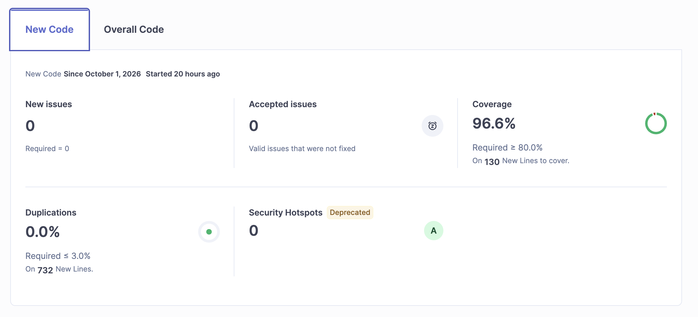

# Rent or buy

One public page that compares buying a home with renting it, in a currency you pick, with no account. The figures are not converted.

## Dev

From the repo root, after `pnpm install`:

```bash
pnpm --filter @sites/rent-or-buy dev
```

The app listens on port 5173. The headline is "Rent or Buy? Let the numbers decide." The sample inputs are a sample, not a forecast.

## Model

Percents in the form are annual percents (6 means 6%). The loan is price minus down payment.

- Monthly payment uses standard amortization. At 0% it is loan divided by months. It is 0 when the loan is 0, and 0 after the term ends.
- Tax and maintenance are that percent of value at the start of the year. Insurance is a flat annual dollar amount. Value then moves by the appreciation rate.
- Year-y rent is monthly rent times 12 times (1 + rent growth) to the power of y minus 1.
- Owning cash is mortgage plus tax plus maintenance plus insurance. Renting cash is rent. Equity is grown value minus remaining principal.
- The down payment compounds monthly at the investment return with no added cash. Each month, existing surplus compounds, then the gap (owner housing cost minus that month's rent) is invested on the cheaper side. Owner housing cost that month is the mortgage payment plus one twelfth of tax, maintenance, and insurance.
- Owning net worth is equity plus owning surplus. Renting net worth is the down payment future value plus renting surplus.
- Horizon is max(20, loan term), capped at 40. The table shows years 5, 10, and 20 in whole dollars.
- Break-even is the first year owning net worth is at least renting net worth. Year 1 reads "ahead from year 1". If owning never catches up, renting stays ahead through the horizon.

Blank fields clear the figures. An invalid field names that field and hides the figures. Inputs are debounced by 100ms and the verdict shows "Updating" while it waits.

## Design

Reading this as: a one-page housing comparison on the site design system in `DESIGN.md`, dial ENERGY 2 / RHYTHM 2 / MOTION 1.

- White `#ffffff` and ink `#222222` come from that system. Gray `#6a6a6a` is only for field suffixes and the sample note.
- Rausch `#ff385c` is the single accent, and only on the monthly payment, which is set at 24px so the coral stays readable on white.
- Public Sans carries the page. Inputs use a 14px radius and the year panel uses 20px, the system's gentle rounding. There is no listing photography because this page is numbers, not places.
- Order is verdict, fields, table, assumptions.
- Phone stacks the form in one column above the year blocks. From 40rem the fields are two columns and the years become columns. From 64rem the two-column form sits beside the table.

## Storybook

Stories for the atoms, molecules, organisms, the page template, and the decision page live in `storybooks/`. Each story renders the real component. Interaction stories use a `play` function so the test runner can exercise them. The Site / Storybook control at the top of the page opens the other view. Storybook keeps the same control and returns to the site you came from.

```bash
pnpm --filter @sites/rent-or-buy storybook
pnpm --filter @sites/rent-or-buy test-storybook
```

`test-storybook` expects the workshop to already be running at http://127.0.0.1:6006.

## Sonar Gate


